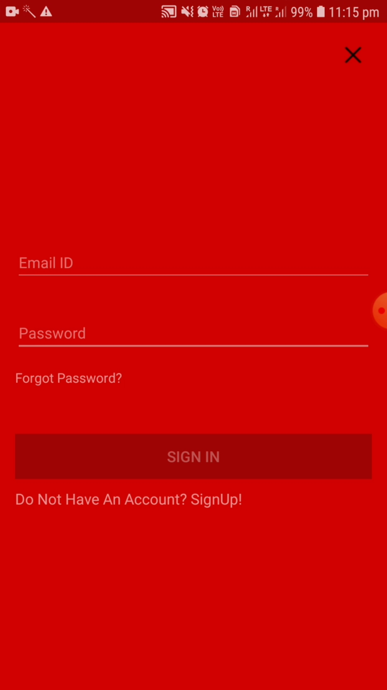
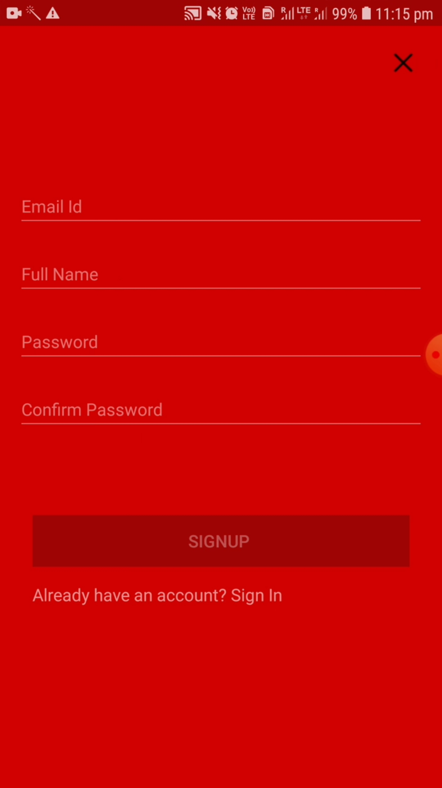
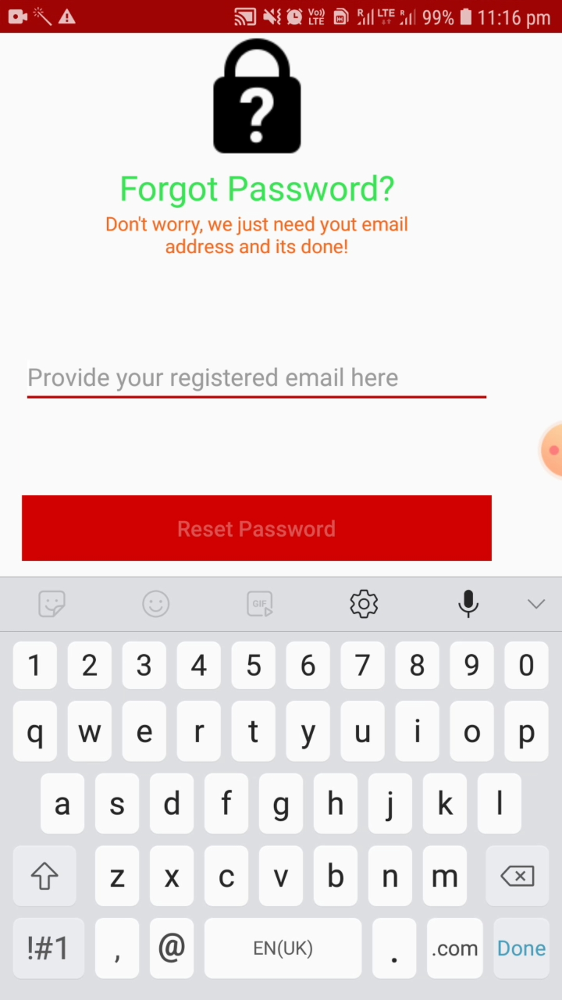
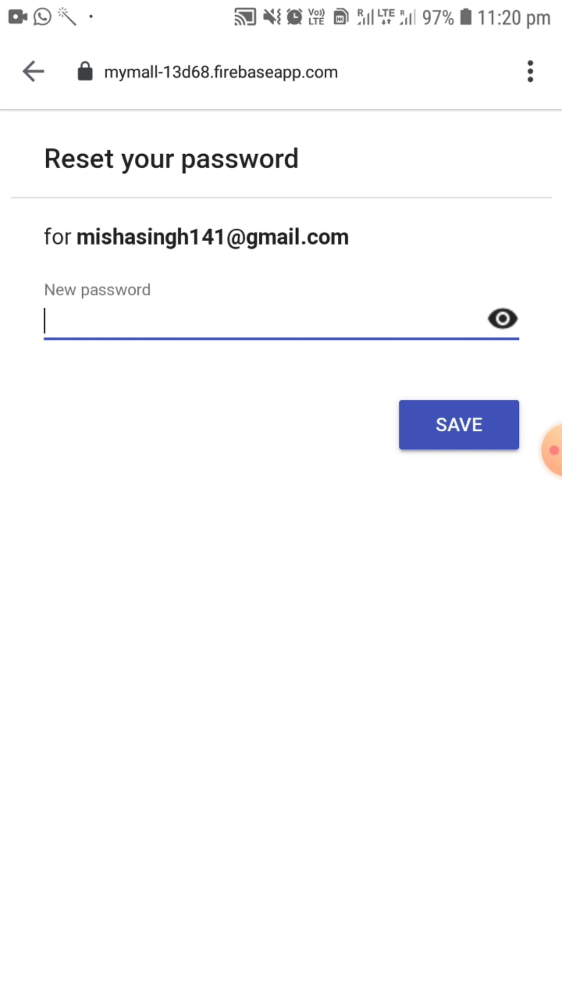

# Login And Signup Fragment Using Firebase

### Login and Signup Fragment

The application consists of login and signup fragments.Each fragment is contained in a frame layout.On sliding the flagments the activities can be switched.Once the user has enter the details in signup page, they are redirected to the main activity.

### Forgot Password 

Also the user can login using the username used during signup process. Also, the user can retain password through the resgistered email id.

